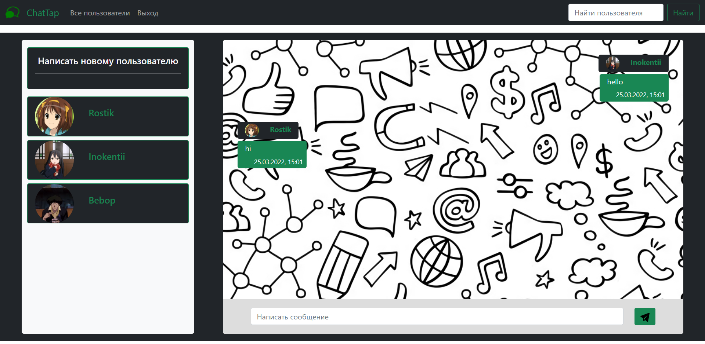
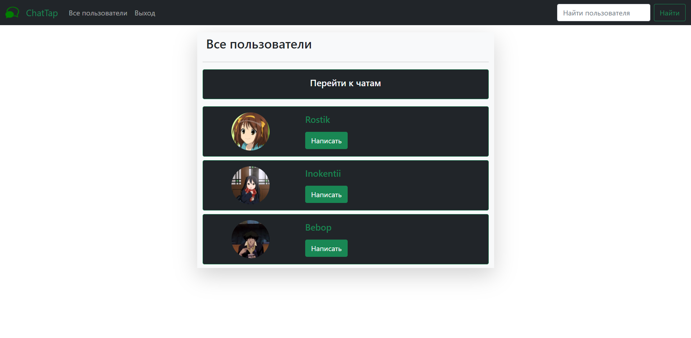
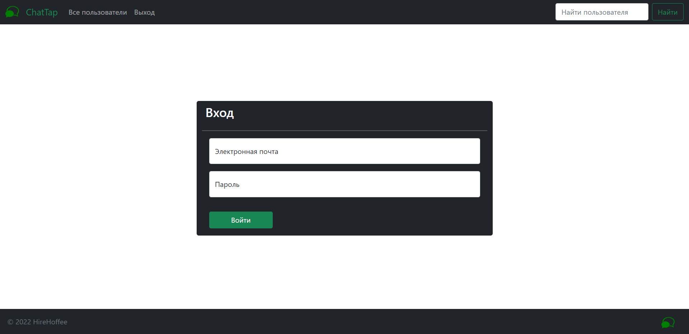

# Chat App

 

  
  

 

## Website functionality

This site is a simple chat application.

On the site you can correspond with users, registration and authorization are also implemented.

 

  

 

## Main site pages

- Main page at `/main`
- All users at `/main/users`
- Registration page `/auth/sign_up`
- Login page `/auth/login`

## Technologies used in the development of the site

#### The following frameworks and technologies were used for the frontend part
- HTML/CSS/JS
- Bootstrap

The site is responsive and is available for comfortable viewing on devices with different screen sizes.

#### The following frameworks and technologies were used for the backend part
- Node.js
- express.js
- MongoDB

#### Communication between users is implemented using a persistent connection (WebSocket)
- SocketIO

## Run application

Clone the repository with `git clone` to run the application.

Next, you must create the mongoDB database. To connect to the database, as well as to form the JWT, environment variables are used, you can define them in the `.env` file or set these parameters directly.

Use the `npm init` command to download all packages and modules.

The server is started with the `npm start` command or `npm dev` to start with the `nodemon` package.